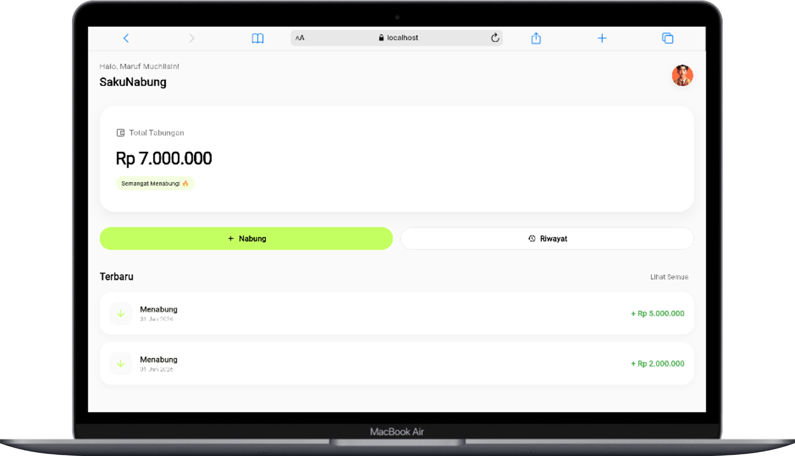

# 💰 SakuNabung


**SakuNabung** adalah aplikasi pencatat tabungan pribadi yang dirancang dengan antarmuka modern (**Glassmorphism**) dan pengalaman pengguna yang intuitif. Aplikasi ini membantu Anda memantau target finansial Anda dengan mudah dan menyenangkan.

---

## ✨ Fitur Utama

* **🎨 Desain Modern & Premium**: Menggunakan gaya desain *Glassmorphism* yang estetis, animasi halus, dan tata letak responsif.
* **📊 Monitoring Real-time**: Pantau total tabungan Anda yang bertambah dengan animasi penghitung yang memuaskan.
* **📝 Pencatatan Mudah**: Tambah tabungan dengan cepat, lengkap dengan fitur format mata uang otomatis (Rupiah).
* **📅 Riwayat Terorganisir**: Lihat perjalanan menabung Anda yang dikelompokkan rapi berdasarkan bulan.
* **👤 Personalisasi Profil**: Ubah nama dan foto profil (Avatar 3D atau Foto sendiri) sesuai keinginan.
* **🔒 Penyimpanan Offline**: Data tersimpan aman di perangkat Anda (Local Storage), tidak perlu koneksi internet.
* **⚡ Performa Tinggi**: Aplikasi dioptimalkan untuk *start-up* cepat dan transisi halaman yang mulus.

## 📱 Tangkapan Layar

### Mobile View

| Dashboard | Formulir Menabung | Profil & Pengaturan |
|:---:|:---:|:---:|
|  |  |  |

### Desktop / Web View



## 🛠️ Teknologi yang Digunakan

* **Framework**: [Flutter](https://flutter.dev/) (SDK >=3.2.0)
* **Bahasa**: Dart
* **State Management**: `setState` (Sederhana & Efisien)
* **Penyimpanan Lokal**: `shared_preferences`
* **Format Tanggal & Angka**: `intl`
* **Media**: `image_picker`

## 🚀 Cara Menjalaankan Aplikasi

1. **Clone Repository**

    ```bash
    git clone https://github.com/Mrmarc-bit/UAS_Aplikasi_MarufMuchlisin_22EO10013.git
    cd UAS_Aplikasi_MarufMuchlisin_22EO10013
    ```

2. **Install Dependencies**

    ```bash
    flutter pub get
    ```

3. **Jalankan Aplikasi**

    ```bash
    flutter run
    ```

## 📂 Struktur Proyek

```
lib/
├── main.dart           # Entry point & Tema aplikasi
├── models/             # Data model (SavingsRecord)
├── pages/              # Halaman UI (Home, Add, History, Settings)
├── services/           # Logika bisnis & Penyimpanan (LocalStorage)
└── widgets/            # Widget kustom (GlassCard, dll)
```

## 👨‍💻 Pengembang

**Maruf Muchlisin**

* NIM: 22EO10013
* Project: Ujian Akhir Semester (UAS) Pemrograman Web/Mobile

---
*Dibuat dengan ❤️ menggunakan Flutter*
